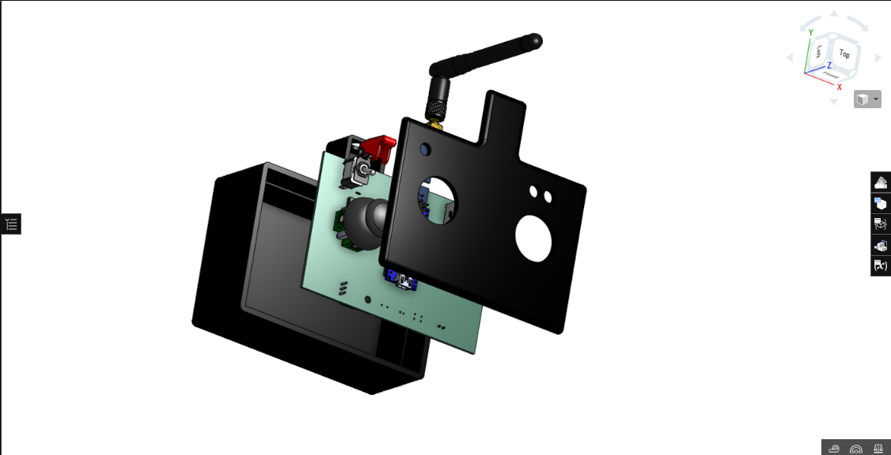
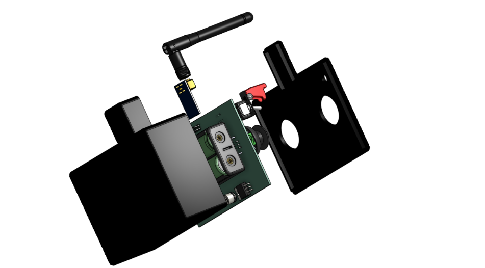
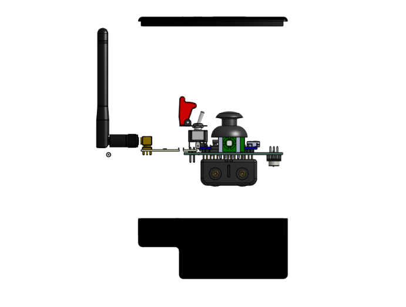
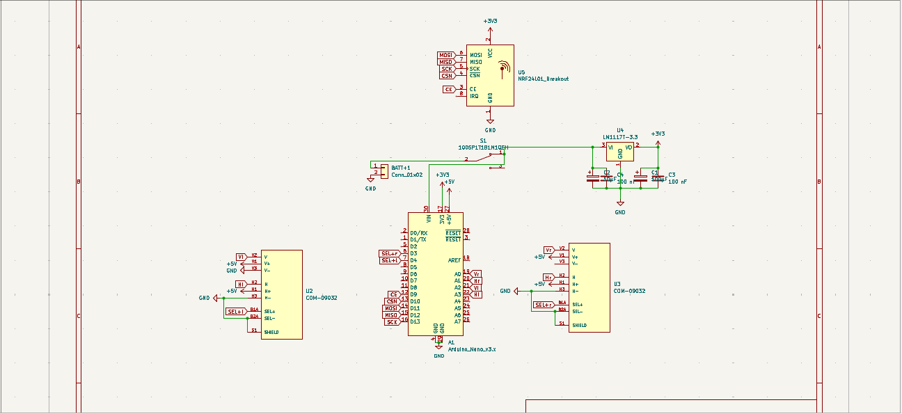
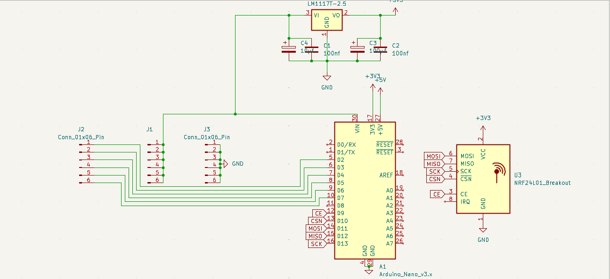
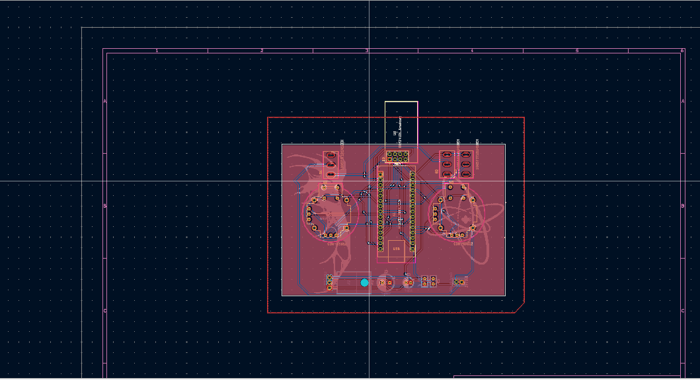
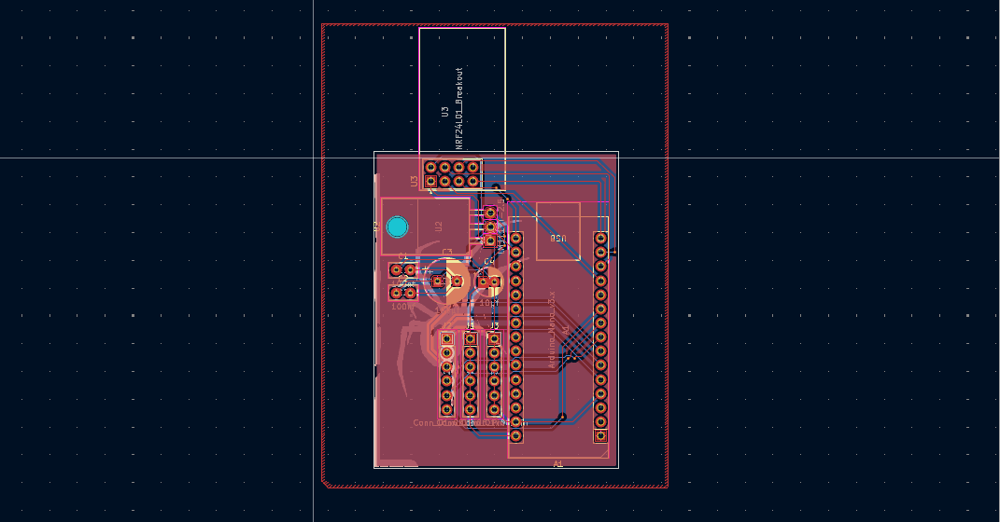
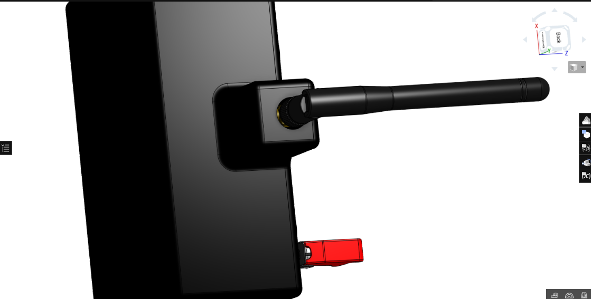

# Transceiver_101
This is a universal remote controller for almost any remote device e.g. Planes,drones,boats or rc cars. It can be mounted and set up in any custom project the needs remote controlling.
---

# Key Features 
-can be used to controll almost any project

-customisable for drone flight controllers

-6 channel controller

-up to 2.5km range 

-2 customizable toggle switch

-Custom code to change as needed

# Images

There is a notch that shuold be kept in mind. 

# BOM

| Name | Purpose | Quantity | Total Cost | Link | Distributor |
| :--- | :--- | :--- | :--- | :--- | :--- |
| **Toggle switch** | Master power | 1 | 5.85 | [Link](https://wv) | Aliexpress |
| **PCB** | circuit board | 2 | 21.7 | [Link](https://jlc) | jlcpcb |
| **Enclosure** | The casing | 1 | 15 | [Link](https://so) | @Souptik Samanta |
| **Battery** | Power | 2 | 14.86 | [Link](https://wv) | Aliexpress |
| **Male headers** | connection | 8 | 4.33 | [Link](https://wv) | Aliexpress |
| **Female Headers** | Mounting | 56 | 6.36 | [Link](https://wv) | Aliexpress |
| **100nf capacitor** | Voltage capping | 4 | 1.07 | [Link](https://wv) | Aliexpress |
| **10uf capacitor** | Voltage regulation | 2 | 0.93 | [Link](https://s.c) | Aliexpress |
| **100uf capacitor** | Voltage regulation | 2 | 2.06 | [Link](https://s.c) | Aliexpress |
| **Arduino Nano** | MCU | 2 | 8.7 | [Link](https://wv) | Aliexpress |
| **Antenna** | Receiver antenna | 1 | 4.75 | [Link](https://wv) | Aliexpress |
| **Receiver Module** | Radio transmission | 1 | 5.62 | [Link](https://wv) | Aliexpress |
| **LM1117T-3.3** | Voltage regulator | 2 | 13.44 | [Link](https://wv) | Aliexpress |
| **Toggle switch** | Channel switch | 2 | 9.94 | [Link](https://wv) | Aliexpress |
| **PS4 Analog** | Controlling | 2 | 4.43 | [Link](https://wv) | Aliexpress |

# Firmware
This remote and receiver uses C++ that is for arduino IDE

Made by Rubaiyat Islam

